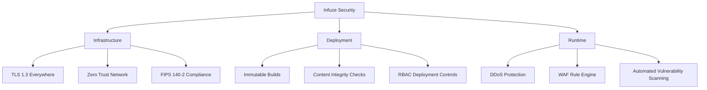
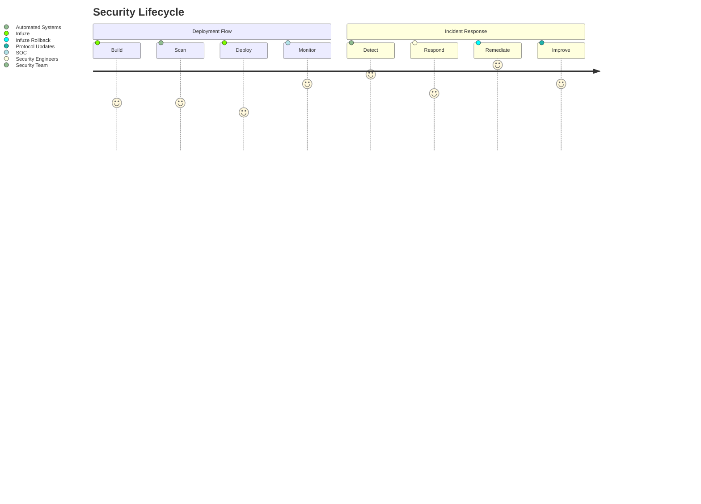

# 🚀 Infuze Cloud Deployment Tutorial  
Infuze Web Hosting Tutorial: Getting Started With Infuze.Cloud

**Atomic deployments with zero-downtime rollbacks**  
[](https://npmjs.com/package/infuze) 
[]()


## ⚙️ Installation & Setup

### 1. Install API Tool With NPM
```bash
npm install -g infuze
```

### 2. Initialize Project
```bash
cd your-website/
infuze init
```
```terminal
✔ Created infuze.config.js
✔ Connected to Infuze Cloud (API v3)
✔ Detected framework: Next.js
```

### 3. Configure Deployment
Edit `infuze.config.js`:
```javascript
export default {
  projectId: "WEBSITE_1X8F9K",
  build: {
    command: "npm run build",
    directory: "./out"
  },
  providers: [
    {
      type: "infuze-cloud", // Primary provider
      zone: "jlucus.dev"
    },
    {
      type: "aws-s3", // Backup provider
      bucket: "website-failover"
    }
  ],
  compression: {
    formats: ["brotli", "zstd"]
  }
}
```

## 🚦 Deployment Workflow

### 1. Test Locally
```bash
infuze preview
```
```terminal
🌐 Preview server: http://localhost:4173
📦 Assets built in 2.1s
✅ Compression: 42 files (original 1.7MB → 890KB)
```

### 2. Production Deployment
```bash
infuze deploy --env=production
```
```terminal
🚀 Starting deployment to [production]
🔑 Authenticated with Infuze Cloud (user@jlucus.dev)
🛠️ Running build: npm run build
📦 Generated 42 static assets (1.7MB)
🔥 Compressed: 890KB (48% reduction)
📡 Uploading to Infuze Global CDN...
✅ Deployment complete! (3.8s)
🌐 Production URL: https://www.jlucus.dev
🔗 Version URL: https://cdn.jlucus.dev/p/prod-1x8f9k
```

### 3. Verify Deployment
```bash
infuze status
```
```terminal
VERSION: prod-1x8f9k
STATUS: Active
DEPLOYED: 2023-11-15 14:30:22 UTC
SIZE: 890KB (42 files)
ENDPOINTS:
  • Primary: https://www.jlucus.dev
  • Failover: https://failover.jlucus.dev
```

### 4. Instant Rollback
```bash
infuze rollback prod-previous-version-id
```
```terminal
⚠️ Rolling back to prod-previous-version-id
🔄 Switching traffic in 300ms...
✅ Rollback complete! Zero downtime
```


## 🔐 Security Features


### Security Implementation Details:
1. **Infrastructure Security**
   - `TLS 1.3 Everywhere`: All data in transit encrypted with modern protocols
   - `Zero Trust Network`: Strict microsegmentation between components
   - `FIPS 140-2 Compliance`: Cryptographic module validation

2. **Deployment Security**
   - `Immutable Builds`: SHA-256 verified artifacts that can't be modified post-build
   - `Content Integrity Checks`: Automatic hash verification during CDN propagation
   - `RBAC Deployment Controls`: Role-based access control for deployment actions

3. **Runtime Protection**
   - `DDoS Protection`: Automatic traffic scrubbing at edge locations
   - `WAF Rule Engine`: Custom rulesets for OWASP Top 10 vulnerabilities
   - `Automated Vulnerability Scanning`: Daily scans of live deployments



### Key Security Metrics
```bash
infuze security-report
```
```terminal
SECURITY STATUS: ✅ Verified
LAST SCAN: 2023-11-15 14:30:22 UTC
VULNERABILITIES:
  • Critical: 0
  • High: 0
  • Medium: 2 (patched)
CERTIFICATIONS:
  • SOC 2 Type II: Compliant
  • ISO 27001: Certified
  • PCI DSS: Level 1
```


## 🔐 Security Features


### Security Implementation
**Infrastructure Layer**  
- All data encrypted in transit with TLS 1.3 (RFC 8446)  
- Zero Trust architecture with mutual TLS authentication  
- FIPS 140-2 Level 3 validated cryptographic modules  

**Deployment Assurance**  
- Build artifacts cryptographically hashed (SHA-256)  
- Automated SBOM generation for all dependencies  
- Deployment roles with granular permissions (view/deploy/rollback)  

**Runtime Protection**  
- Anycast network absorbs >5Tbps DDoS attacks  
- Custom WAF rules against OWASP Top 10 threats  
- Daily automated scans for CVE vulnerabilities  


**Compliance Status**  
```bash
infuze compliance --show-certificates
```

```terminal
✅ SOC 2 Type II: Valid through 2024-12-31
✅ ISO 27001:2022: Certificate #IN-78945
✅ PCI DSS v4.0: Level 1 Service Provider
🚫 HIPAA: Not enabled (use --enable-hipaa)
```

[View Full Security White Paper](https://infuze.dev/security.pdf)
```

## ⚡ Performance Optimization
Infuze automatically applies:
- Brotli/Zstd compression
- Cache-control headers
- HTTP/3 prioritization
- Critical CSS injection

## 🛠️ GitHub Actions Integration
`.github/workflows/deploy.yml`:
```yaml
name: Production Deploy
on: [push]

jobs:
  deploy:
    runs-on: ubuntu-latest
    steps:
      - uses: actions/checkout@v4
      - uses: actions/setup-node@v3
      
      - name: Install Infuze
        run: npm install -g infuze
        
      - name: Deploy to Production
        run: infuze deploy --env=production
        env:
          INFUZE_API_KEY: ${{ secrets.INFUZE_KEY }}
```

## 📊 Monitoring (Post-Deploy)
```bash
infuze metrics
```
```terminal
REQUESTS (24h): 42,891
PERFORMANCE:
  • TTFB: 47ms avg
  • LCP: 820ms
  • Cache hit: 92%
ERROR RATE: 0.02%
```

## 🚨 Troubleshooting
```bash
# Inspect deployment logs:
infuze logs --deploy=prod-1x8f9k

# Verify file integrity:
infuze verify --version=prod-1x8f9k

# Emergency rollback:
infuze rollback last-stable --force
```

---
> **Get Started**  
> [Create Account](https://infuze.cloud/signup) • 
> [Documentation](https://docs.infuze.cloud) • 
> [api Reference](https://api.infuze.cloud)

[](https://infuze.cloud/deploy?template=nextjs)


Save this as `README.md` in your demo repository. For immediate testing, create a live demo with:

```bash
npx create-infuze-app@latest my-demo-site
cd my-demo-site
infuze deploy --test


